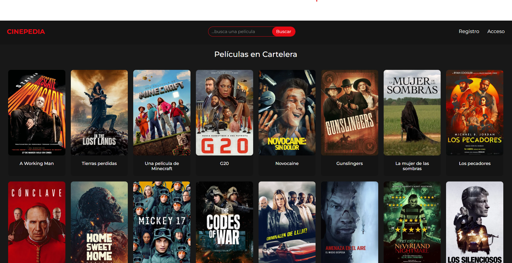

# CINEPEDIA

## [See the App!](https://cinepedia-zlta.onrender.com)



## Description

**Cinepedia** is a full stack web application with server-side rendering (SSR) using Node & Express and Handlebars. Users can register, search for movies, write reviews, and upload images. The platform also features an admin dashboard to manage users and content.

## User Stories

- **404** – As a user, I want to see a friendly 404 error page when I access a non-existent route, so that I know I made a mistake.
- **500** – As a user, I want to see a fun 500 error page when something fails on the server, so that I know it’s not my fault.
- **Homepage** – As a user, I want to access the homepage so I can explore the latest activity and navigate the app.
- **Sign Up** – As a user, I want to register on the platform so I can create reviews and lists.
- **Email Confirmation** – As a user, I want to confirm my email after signing up so I can activate my account.
- **Login** – As a user, I want to log in to the platform so I can access my profile and private functionalities.
- **Logout** – As a user, I want to log out so I can keep my account secure.
- **My Reviews** – As a user, I want to view a list of my own reviews so I can manage or review what I’ve posted.
- **Create Review** – As a user, I want to write a review for a movie so I can share my opinion with others.
- **Upload Image** – As a user, I want to upload an image along with my review so it looks more visual.
- **Lists** – As a user, I want to create personal movie lists so I can group my favorite movies.
- **View List** – As a user, I want to view my saved lists so I can revisit them later.
- **Admin Panel** – As an admin, I want to access a dashboard where I can manage users and reviews.
- **Search Reviews (admin)** – As an admin, I want to search and list all reviews by username or content so I can moderate the platform more effectively.
- **Manage Users** – As an admin, I want to view, ban, or delete users so I can moderate the platform.
- **Manage Reviews** – As an admin, I want to view and delete any review so I can moderate inappropriate content.
- **Banned Users** – As a banned user, I want to be blocked from accessing protected areas so that the platform stays safe.

## Backlog Functionalities

Add success messages after actions (e.g., review posted, session closed), make design more mobile-friendly and add password recovery feature

## Technologies used

HTML, CSS, Javascript, Node, Express, Handlebars, TMDB API, Express-session, Cloudinary and Multer, Bcryptjs, Nodemailer, Render, MongooseDB

## Models

User model

```
username: {
  type: String,
  trim: true,
  required: true,
  unique: true,
},
email: {
  type: String,
  required: true,
  unique: true,
  lowercase: true,
  trim: true,
},
status: {
  type: String,
  enum: ["Pending Confirmation", "Active"],
  default: "Pending Confirmation",
},
confirmationCode: {
  type: String,
  unique: true,
},
password: {
  type: String,
  required: true,
},
perfilImage: {
  type: String,
  default: "https://i.imgur.com/6VBx3io.png",
},
isBanned: {
  type: Boolean,
  default: false,
},
role: {
  type: String,
  enum: ["user", "admin"],
  default: "user",
}

```

List model

```
name: {
  type: String,
  required: true,
  trim: true,
},
user: {
  type: Schema.Types.ObjectId,
  ref: "User",
},
movies: [
  {
    type: String,
    required: true,
  },
]
```

Review model

```
movieId: String,
rating: {
  type: Number,
  required: true,
  min: 1,
  max: 5,
},
comment: {
  type: String,
  required: true,
  maxlength: 1000,
},
user: {
  type: Schema.Types.ObjectId,
  ref: "User",
}
```

## Links

[Álvaro Herrero](https://github.com/alvaritohegon)
